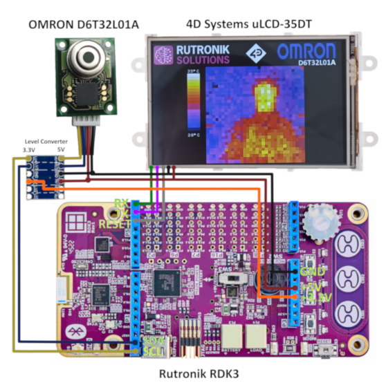
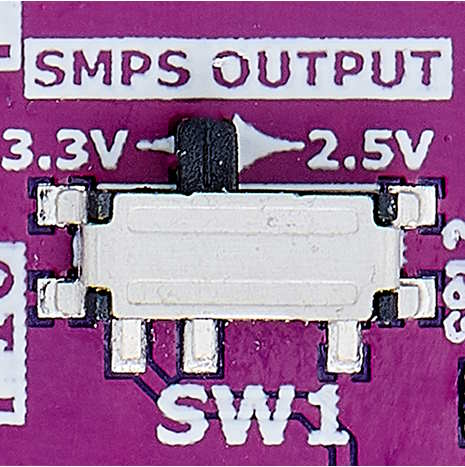
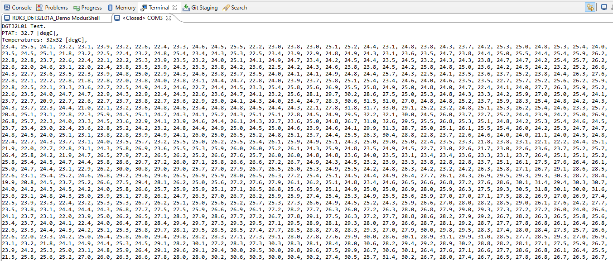
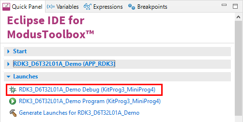

# RDK3 OMRON D6T32L01A Demonstration

This is the OMRON D6T32L01A sensor demonstration in ModusToolbox™ IDE using the Rutronik RDK3 development kit. The 4D SYSTEMS display module  uLCD-35DT is optional for this demo since the data may be printed out through the KitProg3 terminal.

 

## Requirements

- [ModusToolbox® software](https://www.infineon.com/cms/en/design-support/tools/sdk/modustoolbox-software/) **v3.x** [built with **v3.1**]

- [ModusToolbox® software](https://www.infineon.com/cms/en/design-support/tools/sdk/modustoolbox-software/) **v3.2**: 

1. The [Python](https://www.python.org/) has to be installed manually on Windows OS.
2. Make sure the Python installation is added to the path variable. 
3. Use this command to install the [cysecuretools](https://pypi.org/project/cysecuretools/) package:

```
pip install cysecuretools
```

## Supported toolchains (make variable 'TOOLCHAIN')

- GNU Arm&reg; Embedded Compiler v11.3.1 (`GCC_ARM`) - Default value of `TOOLCHAIN`

## The Provisioning of the RDK3

The CYB06447BZI-BLD53 device must be provisioned with **keys** and **policies** before being programmed. If the kit is already provisioned, copy-paste the keys and policy folder to the application folder. If the unsigned or not properly signed image will be written to the RDK3 PSoC™ 64 – the microcontroller will not boot. 

The “[Secure Policy Configurator](https://www.infineon.com/dgdl/Infineon-ModusToolbox_Secure_Policy_Configurator_1.30_User_Guide-UserManual-v01_00-EN.pdf?fileId=8ac78c8c8386267f0183a960762a5977)” tool is used for the provisioning of the new RDK3, please refer to the “ModusToolbox™ Secure Policy Configurator user guide”. 

The CYB06447BZI-BLD53 MCU must be powered from a 2.5V power source to be able to complete the provisioning. The RDK3 has an SMPS [Switching Mode Power Supply] which can be easily adjusted to provide 3.3V or 2.5V to the MCU by switching the slide-switch “SW1” on the bottom side of the board. 



## Using the code example

Create the project and open it using one of the following:

<details><summary><b>In Eclipse IDE for ModusToolbox&trade; software</b></summary>


1. Click the **New Application** link in the **Quick Panel** (or, use **File** > **New** > **ModusToolbox&trade; Application**). This launches the [Project Creator](https://www.infineon.com/ModusToolboxProjectCreator) tool.

2. Pick a kit supported by the code example from the list shown in the **Project Creator - Choose Board Support Package (BSP)** dialog.

   When you select a supported kit, the example is reconfigured automatically to work with the kit. To work with a different supported kit later, use the [Library Manager](https://www.infineon.com/ModusToolboxLibraryManager) to choose the BSP for the supported kit. You can use the Library Manager to select or update the BSP and firmware libraries used in this application. To access the Library Manager, click the link from the **Quick Panel**.

   You can also just start the application creation process again and select a different kit.

   If you want to use the application for a kit not listed here, you may need to update the source files. If the kit does not have the required resources, the application may not work.

3. In the **Project Creator - Select Application** dialog, choose the example by enabling the checkbox.

4. (Optional) Change the suggested **New Application Name**.

5. //#define USE_KITPROG3_OUTPUT
   #define USE_DISPLAY_OUTPUTThe **Application(s) Root Path** defaults to the Eclipse workspace which is usually the desired location for the application. If you want to store the application in a different location, you can change the *Application(s) Root Path* value. Applications that share libraries should be in the same root path.

6. Click **Create** to complete the application creation process.

For more details, see the [Eclipse IDE for ModusToolbox&trade; software user guide](https://www.infineon.com/MTBEclipseIDEUserGuide) (locally available at *{ModusToolbox&trade; software install directory}/docs_{version}/mt_ide_user_guide.pdf*).

</details>

### Operation

All the temperatures of the 1024 sensors are printed out to the KitProg3 UART terminal every 200 milliseconds. If LCD is available please configure the definitions in `main.c` shown below:

```
//#define USE_KITPROG3_OUTPUT
#define USE_DISPLAY_OUTPUT
```



Please note that the averaging (0 to 10) and IIR filter (0 to 15) of the D6T32L01A might be adjusted in `d6t32l01a.h`:

```
#define D6T_IIR 		0x0F
#define D6T_AVERAGE 	0x00
```


### Debugging

If you successfully have imported the example, the debug configurations are already prepared to use with a the KitProg3 or MiniProg4. Open the ModusToolbox™ perspective and find the Quick Panel. Click on the desired debug launch configuration and wait for the programming to complete and the debugging process to start.



## Legal Disclaimer

The evaluation board including the software is for testing purposes only and, because it has limited functions and limited resilience, is not suitable for permanent use under real conditions. If the evaluation board is nevertheless used under real conditions, this is done at one’s responsibility; any liability of Rutronik is insofar excluded. 


